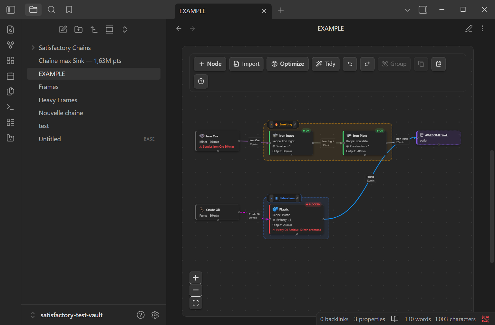
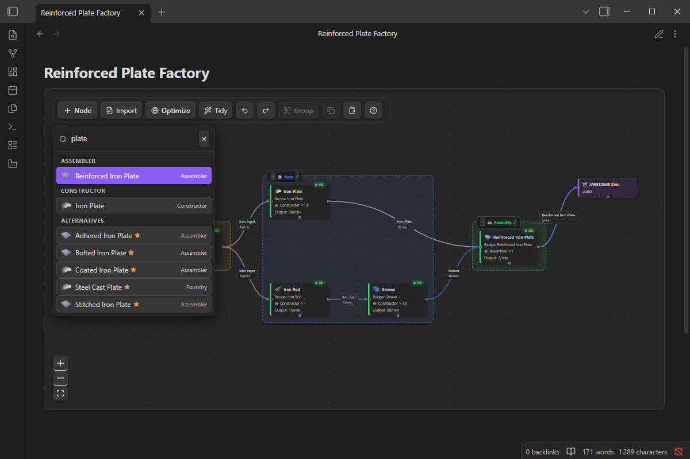
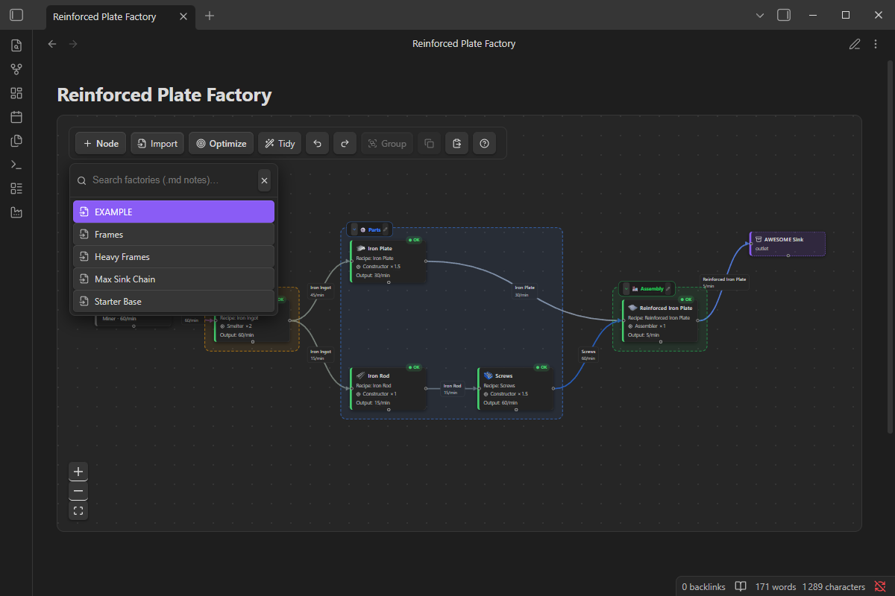
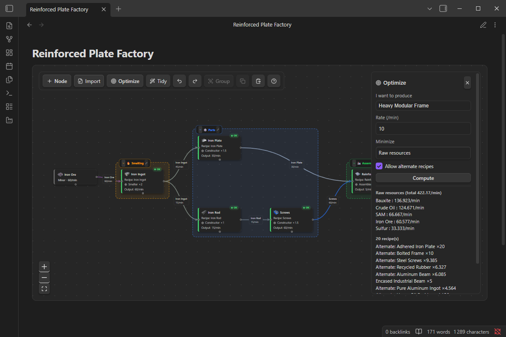

# Satisfactory chains — Obsidian plugin

Document, **visualize**, **verify** and **optimize** [Satisfactory](https://www.satisfactorygame.com/) production chains directly in Obsidian. **The source of truth is 100% Markdown**: everything (chain, positions, layers, rates) lives in a ` ```satisfactory ` code block that is editable **with the mouse as well as by an AI**.

> A **verifier + optimizer**, not just a generator: you design your chain, the tool validates that it actually works (orphaned by-products, unbalanced rates…) and can **compute the cheapest chain in raw resources**.



---

## Contents
- [Installation](#installation)
- [Quick start](#quick-start)
- [The `satisfactory` block (humans + AIs)](#the-satisfactory-block-humans--ais)
- [Mouse editing](#mouse-editing)
- [Optimizer](#optimizer)
- [Diagnostics (node colors)](#diagnostics-node-colors)
- [Game database](#game-database)
- [Instructions for an AI](#instructions-for-an-ai)
- [Development](#development)
- [Credits & licenses](#credits--licenses)

---

## Installation

**Community plugins (recommended, once published):** Settings → *Community plugins* → disable *Restricted mode* → *Browse* → search "Satisfactory chains" → Install → Enable.

**Manual:** copy `main.js`, `manifest.json` and `styles.css` into
`<vault>/.obsidian/plugins/satisfactory-chains/`, then enable the plugin
(*Settings → Community plugins*) and restart Obsidian if needed.

The game database is **bundled**: nothing else to install. This plugin is desktop-only.

> **First launch:** the plugin creates a "Satisfactory Chains" folder in your vault containing `Guide.md` (full user + AI guide), `items.md` and `recipes.md` (the game database as Markdown). Delete it freely — it is not recreated automatically (the "Open the Satisfactory guide" command restores it).

---

## Quick start

Create a note with a ` ```satisfactory ` code block:

````markdown
```satisfactory
nodes:
  - { id: ore, recipe: "", machines: 1, machine: Miner, inputs: [], outputs: [{ item: iron-ore, rate: 60 }] }
  - { id: ingot, recipe: recipe-ingotiron-c, machines: 1 }
  - { id: plate, recipe: recipe-ironplate-c, machines: 1 }
links:
  - { from: ore, to: ingot, product: iron-ore, rate: 30 }
  - { from: ingot, to: plate, product: iron-ingot, rate: 30 }
  - { from: plate, to: SINK, product: iron-plate, rate: 20 }
```
````

The block renders as an interactive graph. Every mouse action **writes the block back**.

---

## The `satisfactory` block (humans + AIs)

The block body is **YAML**. Three lists: `nodes`, `links`, `layers`.

### `nodes` — the machines you placed
```yaml
nodes:
  - { id: A, recipe: recipe-ironplate-c, machines: 2, pos: [320, 60], layer: smelting }
```
| field | type | required | role |
|---|---|:---:|---|
| `id` | text | ✅ | unique node identifier in the scene |
| `recipe` | slug | ✅ | DB recipe (e.g. `recipe-ironplate-c`). `""` for a custom node |
| `machines` | number | ✅ | machine count (decimals OK = clock speed). Multiplies the recipe rates |
| `pos` | `[x, y]` | — | position; auto-placed otherwise |
| `layer` | layer id | — | attaches the node to a layer |
| `machine` | text | — | **(custom)** machine name, otherwise the recipe's |
| `inputs` | `[{item, rate}]` | — | **(custom)** ABSOLUTE input rates /min — overrides the recipe |
| `outputs` | `[{item, rate}]` | — | **(custom)** ABSOLUTE output rates /min — overrides the recipe |
| `import` | note name | — | imports the production of another note as a black box, kept in sync |

> **Normal node**: `recipe` + `machines` → rates = recipe × machines (game ratios).
> **Custom node**: as soon as `inputs` or `outputs` is present, the node ignores the recipe and uses **those rates as-is** (useful for an extraction source, or an item missing from the DB).
> **Import node**: `import: "Frames"` exposes the deliverables of `Frames.md` (× `machines`) — edit that note and every importer updates automatically.

### `links` — the routing (what feeds what)
```yaml
links:
  - { from: A, to: B, product: iron-ingot, rate: 30 }
  - { from: A, to: SINK, product: silica, rate: 50 }
```
| field | type | required | role |
|---|---|:---:|---|
| `from` | node id | ✅ | source node |
| `to` | node id **or** `SINK` | ✅ | destination (or the AWESOME Sink) |
| `product` | item slug | ✅ | transported item |
| `rate` | number | ✅ | rate /min on this link |
| `loop` | `true` | — | upstream reinjection (rendered ♻) |

> `SINK` is a special target (terminal outlet). A link encodes a **routing decision**: it's what the diagnostics read to spot by-products without an outlet.

### `layers` — grouping (modularity)
```yaml
layers:
  - { id: smelting, name: "Smelting", icon: "🔥", color: "#f59e0b", collapsed: false }
```
| field | type | required | role |
|---|---|:---:|---|
| `id` | text | ✅ | layer identifier (referenced by `nodes[].layer`) |
| `name` | text | ✅ | displayed title |
| `icon` | text/emoji | — | pictogram |
| `color` | hex `#rrggbb` | — | frame color |
| `collapsed` | `true` | — | rendered collapsed as a **module node** with aggregated ports |

> The original French keys (`noeuds`, `liens`, `calques`, `recette`, `debit`, `de`/`vers`/`produit`…) are still accepted on read for backward compatibility; the plugin writes the English keys.

### Slugs (items & recipes)
- **Item** = display name in kebab-case: `Iron Plate` → `iron-plate`, `Crude Oil` → `crude-oil`.
- **Recipe** = className in kebab-case: `Recipe_IronPlate_C` → `recipe-ironplate-c`.
- The full list (177 items, 276 recipes) ships with the plugin and is exported to your vault as `items.md` / `recipes.md`. In the UI, pickers show **readable names**.

---

## Mouse editing

| Action | Gesture |
|---|---|
| Add a node | **+ Node** (`N` → created at the mouse position) → searchable picker grouped by machine, alternates apart |
| Add a node at a spot | right-click the background → *Add a node here…* |
| Import another factory | **Import** (toolbar) or right-click → *Import a factory here…* |
| Create a consumer | drag an output handle into empty space → filtered picker → node created + linked |
| Move a node | drag (writes `pos` on drop) |
| Edit a node | **double-click** it → panel (recipe, machines, custom rates) |
| Edit a value | **double-click** the value (machines, rate, machine) |
| Connect two nodes | drag handle to handle (product picked automatically; message if refused) |
| Delete | **✕** on hover (node or link), or `Del` |
| Multi-select | **Shift+drag** (box) · Shift/Ctrl+click · `Ctrl+A` |
| Create a layer | selection → **Group** (`G`) |
| Collapse / expand a layer | chevron on its header |
| Copy / paste | `Ctrl+C` / `Ctrl+V` |
| Tidy | **Tidy** (`R`, left-to-right auto-layout) |
| Undo / redo | **Ctrl+Z** / **Ctrl+Shift+Z** |
| Help | `?` or the toolbar button — full keyboard + mouse reference |





Everything is written back to the `.md` (stable camera, no flicker).

> **Setting** (*Settings → Satisfactory chains*): **Whole machines** — disabled by default (decimals allowed, useful for clock speed); enabled, machine counts are rounded when editing.

---

## Optimizer

**Optimize** button → item + target rate → the solver computes the recipe
combination (**alternates included, or standard-only**) that **minimizes raw
resources or machine count** (your choice; water is free because unlimited).

- Shows the **raw total** + the **recipe list**.
- **Generate the chain** builds the whole scene (nodes, links, extraction
  sources, auto-layout) right into the block.

It is a **linear programming** problem: variables = machine count per recipe +
extraction per resource; constraint = balance ≥ demand for every item;
objective = minimize the chosen cost. Details in [`src/model/solver.ts`](./src/model/solver.ts).



---

## Diagnostics (node colors)

Computed by a **pure function** of `(scene + DB)` — hence **recomputable by an AI**
from the text, identical to the plugin. Full rules: [`DIAGNOSTIC.md`](./DIAGNOSTIC.md).

- 🔴 **blocked**: an output **without a valid outlet** (orphan); a link whose target doesn't consume the product; or a **fluid sent to the Sink** (the Sink only accepts solids).
- 🟡 **check**: surplus / shortfall of a product, under-supplied input.
- 🟢 **ok**: everything balanced and supplied.

---

## Game database

- **Bundled** with the plugin (generated, works out of the box): 177 items, 276 machine recipes (110 alternates), 13 raw resources — Satisfactory 1.0.
- Source: the `data.json` of [greeny/SatisfactoryTools](https://github.com/greeny/SatisfactoryTools) (MIT), itself derived from the game's official `Docs.json`.
- **Update**: drop a fresh `data.json` into `_data/greeny.json` then `node _data/generate.cjs` + `node _data/fetch-icons.cjs` + `npm run build`.

---

## Instructions for an AI

An AI can **read and edit chains as text**, without the plugin — the bundled
guide (`Satisfactory Chains/Guide.md` in your vault) is self-contained and
includes the AI workflow: read `items.md`/`recipes.md` for slugs, respect the
outlet rules (orphan by-products block the chain, the Sink refuses fluids,
water is unlimited), self-check the diagnostics, write into a dedicated note.

The plugin and the AI produce the **same diagnostics** from the same `.md` →
the text stays authoritative, even without the plugin loaded.

---

## Development

```bash
npm install
npm run dev      # watch build
npm run build    # production build (typecheck + bundle)
```

End-to-end tests inside the **real Obsidian** via the Chrome DevTools Protocol:
```bash
npm run deploy:test                      # deploy the build into the test vault
npm run launch:test                      # Obsidian in debug mode
npm run test:e2e                         # 24 assertions (render, write-back, editing, picker, menu…)
```

---

## Credits & licenses

- Plugin code: [AGPL-3.0-or-later](./LICENSE) — Copyright (C) 2026 Pierre Bisiaux. Personal use and modification are free; any **redistribution** of a modified version must stay open source.
- Bundled libraries: [React Flow / @xyflow/react](https://github.com/xyflow/xyflow) (MIT), [React](https://react.dev) (MIT), [lucide-react](https://lucide.dev) (ISC), [@dagrejs/dagre](https://github.com/dagrejs/dagre) (MIT), [javascript-lp-solver](https://github.com/JWally/jsLPSolver) (Unlicense).
- Game data derived from [greeny/SatisfactoryTools](https://github.com/greeny/SatisfactoryTools) (MIT). Item icons fetched from the [official Satisfactory wiki](https://satisfactory.wiki.gg).
- **Satisfactory** is a trademark of Coffee Stain Studios AB. Game names and icons are © Coffee Stain Studios, used nominatively for documentation in this **unofficial**, free, non-commercial community tool, **not affiliated with or endorsed by Coffee Stain Studios**. Any infringing material will be removed on request.
